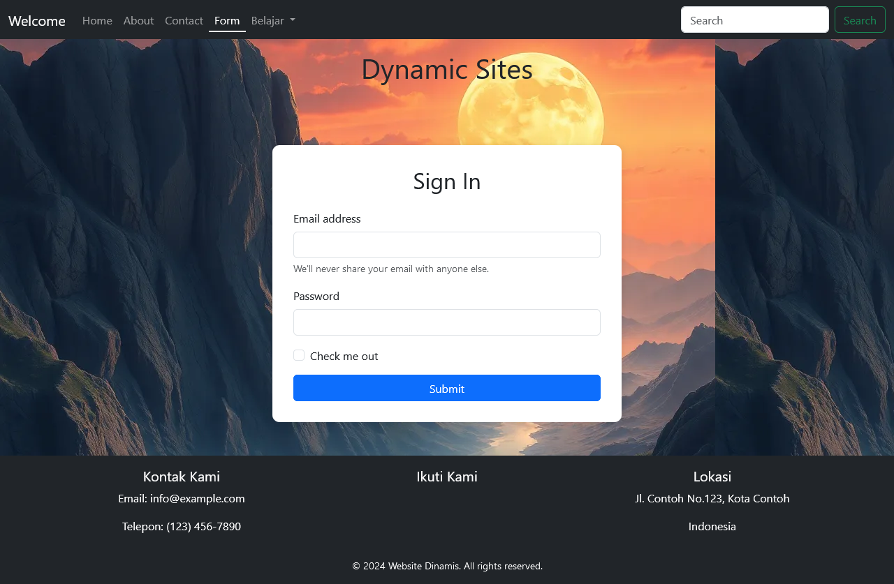
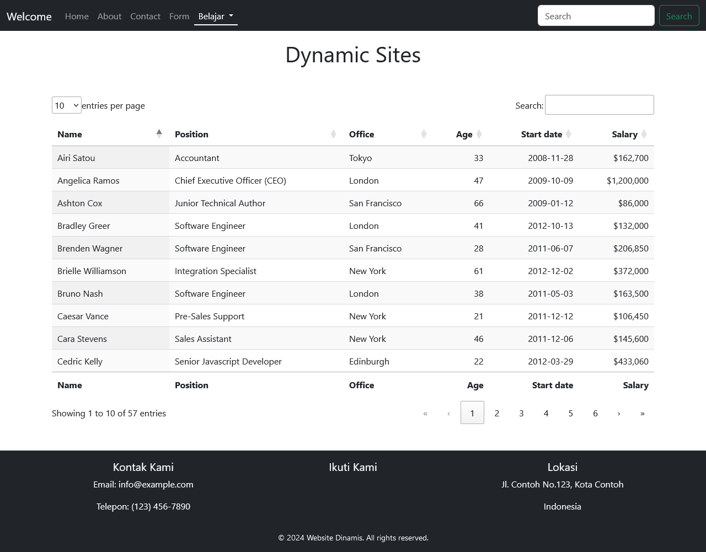

# UTS - Pertemuan ke 8

# Tugas Pertemuan ke 8 { UTS }

| **Nama**            | **NIM**   | **Kelas** | **Matkul**       |
| ------------------- | --------- | --------- | ---------------- |
| Fadzar Surya Wijaya | 312310451 | TI.23.A.5 | Pemograman Web 1 |

# Interface Website

> Menu navigasi di bagian atas membantu pengguna mengakses halaman-halaman utama dengan cepat, seperti "Welcome," "Home," "About," "Contact," "Form," dan "Belajar." Setiap bagian dari halaman ini, mulai dari kartu informasi produk hingga tabel data, memiliki elemen interaktif seperti fitur pencarian dan pengaturan jumlah tampilan entri, sehingga pengguna dapat menyesuaikan tampilan sesuai kebutuhan mereka.Desainnya mengutamakan kemudahan navigasi, pengalaman pengguna yang nyaman, serta tampilan visual yang menarik.

## Home


> Melakukan Insert Card Component pada Bootstrap5 serta menampilkan Datatables

```
    <!-- Menampilkan DataTables default -->
    <?php include "includes/datatables.php" ?>
    <!-- Menampilkan DataTables default -->

 <div class="card-group">
        <div class="card">
            
            <div class="card-body">
                <h5 class="card-title">Card title</h5>
                <p class="card-text">Volkswagen, merek otomotif Jerman yang ikonik, dikenal dengan inovasi dan desain klasiknya. Model terkenal seperti VW Beetle dan Golf menawarkan kombinasi sempurna antara performa, efisiensi bahan bakar, dan kenyamanan. Dengan teknologi mutakhir dan fitur keselamatan yang canggih, VW adalah pilihan ideal untuk pengendara modern.</p>
            </div>
            <div class="card-footer">
                <small class="text-body-secondary">Last updated 3 mins ago</small>
            </div>
        </div>
        <div class="card">
            
            <div class="card-body">
                <h5 class="card-title">Card title</h5>
                <p class="card-text">Toyota Century adalah sedan mewah yang dirancang untuk menawarkan kenyamanan dan prestise tertinggi. Dengan desain yang elegan dan interior berkualitas tinggi, Century menjadi simbol status di Jepang. Ditenagai oleh mesin hybrid yang efisien, mobil ini menggabungkan kemewahan dengan tanggung jawab lingkungan.</p>
            </div>
            <div class="card-footer">
                <small class="text-body-secondary">Last updated 3 mins ago</small>
            </div>
        </div>
        <div class="card">
            <div id="carouselExampleFade" class="carousel slide carousel-fade">
                <div class="carousel-inner">
                    <div class="carousel-item active">
                        
                    </div>
                    <div class="carousel-item">
                        
                    </div>
                    <div class="carousel-item">
                        
                    </div>
                </div>
                <button class="carousel-control-prev" type="button" data-bs-target="#carouselExampleFade" data-bs-slide="prev">
                    <span class="carousel-control-prev-icon" aria-hidden="true"></span>
                    <span class="visually-hidden">Previous</span>
                </button>
                <button class="carousel-control-next" type="button" data-bs-target="#carouselExampleFade" data-bs-slide="next">
                    <span class="carousel-control-next-icon" aria-hidden="true"></span>
                    <span class="visually-hidden">Next</span>
                </button>
            </div>
            <div class="card-body">
                <h5 class="card-title">Toyota</h5>
                <p class="card-text">Toyota Avanza adalah MPV (Multi-Purpose Vehicle) yang populer di Indonesia, dikenal karena ruang kabin yang luas dan fleksibilitasnya. Dengan desain yang stylish dan efisiensi bahan bakar yang baik, Avanza ideal untuk keluarga dan perjalanan sehari-hari. Fitur keselamatan dan kenyamanan modern membuatnya menjadi pilihan yang tepat untuk mobilitas keluarga.</p>
            </div>
            <div class="card-footer">
                <small class="text-body-secondary">Last updated 3 mins ago</small>
            </div>
        </div>
    </div>
```

## About


>Halaman About Portofolio Sang Pengguna, Menggunakan Typed.js untuk menambah user experience

## Contact


> Membuat elemen form pada bootstrap5 dan membuat card untuk detail informasi pada kontak ditambah membuat Header dengan class bunga

```
<body>
    <!-- Bagian Header -->
    <header class="bunga">
        <h1>Kontak Kami</h1>
        <p>Silakan hubungi kami untuk informasi lebih lanjut</p>
    </header>

    <!-- Konten Utama -->
    <div class="container">
        <div class="row">
            <!-- Form Kontak -->
            <div class="col-md-6">
                <h3>Kirim Pesan</h3>
                <form>
                    <label for="name" class="form-label">Nama</label>
                    <input type="text" class="form-control" id="name" placeholder="Nama Anda">

                    <label for="email" class="form-label">Email</label>
                    <input type="email" class="form-control" id="email" placeholder="email@example.com">

                    <label for="message" class="form-label">Pesan</label>
                    <textarea class="form-control" id="message" rows="4" placeholder="Tulis pesan Anda di sini..."></textarea>

                    <button type="submit" class="btn-primary">Kirim Pesan</button>
                </form>
            </div>

            <!-- Informasi Kontak -->
            <div class="col-md-6">
                <h3>Informasi Kontak</h3>
                <ul class="list-unstyled">
                    <li><strong>Alamat:</strong>Jl. Inspeksi Kalimalang No.9, Cibatu,Cikarang Sel., Kabupaten Bekasi,Jawa Barat, 17530 </li>
                    <li><strong>Email:</strong> Nilai100@gmail.com</li>
                    <li><strong>Telepon:</strong> +62 123 456 789</li>
                </ul>
                <h4>Ikuti Kami</h4>
                <div class="d-flex">
                    <a href="https://www.facebook.com/?locale=id_ID" class="text-primary"><i class="fab fa-facebook"></i> Facebook</a>
                    <a href="https://www.x.com" class="text-info"><i class="fab fa-twitter"></i> Twitter</a>
                    <a href="https://www.instagram.com" class="text-danger"><i class="fab fa-instagram"></i> Instagram</a>
                </div>
            </div>
        </div>
    </div>
</body>

<!-- Codingan lebih lengkap ada pada file about.php -->
```

## Form


> Elemen Form bootstrap 5 serta visual background yang indah

## Data Tables


> Menambah dan mengintegrasikan Data Tables.
 Silahkan kunjungi website berikut ini untuk informasi lebih lanjut: " <a href="https://datatables.net/examples/styling/bootstrap5" alt="bootstrap5datatables"> Datatables Bootsrap 5</a> "
